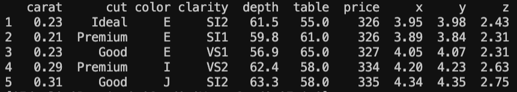
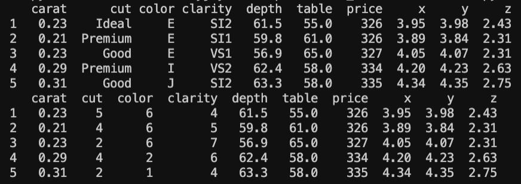
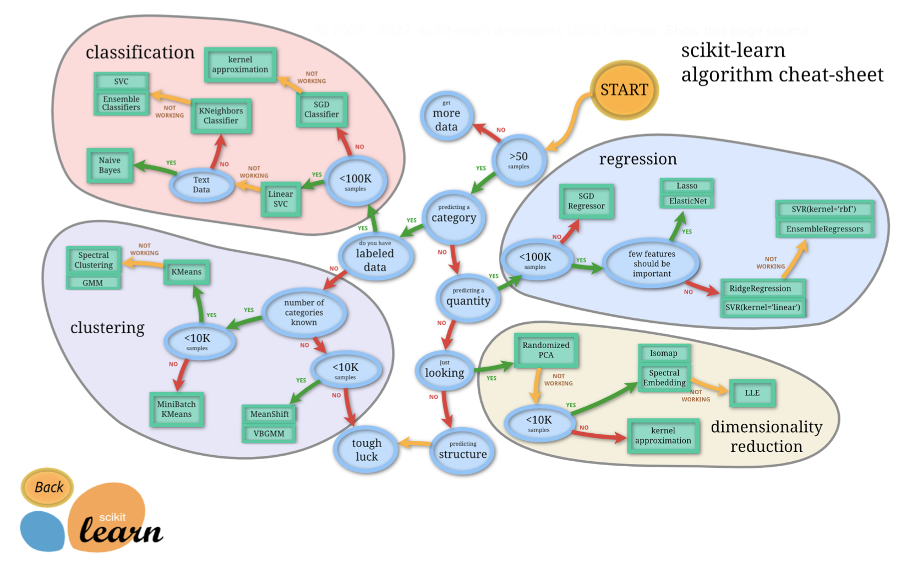

# Diamonds
- Analyze diamonds by their cut, color, clarity, price, and other attributes
# Goal
- Come up with some sort of formula to take inputs like carat, cut, color, clarity, depth, table, x, y, and z to then see if we can predict the price.
- We will use machine learning principles to achieve this. 
# About Dataset
# Context
This classic dataset contains the prices and other attributes of almost 54,000 diamonds. It's a great dataset for beginners learning to work with data analysis and visualization.
# Content
- price price in US dollars (\$326--\$18,823)
- carat weight of the diamond (0.2--5.01)
- cut quality of the cut (Fair, Good, Very Good, Premium, Ideal)
- color diamond color, from J (worst) to D (best)
- clarity a measurement of how clear the diamond is (I1 (worst), SI2, SI1, VS2, VS1, VVS2, VVS1, IF (best))
- x length in mm (0--10.74)
- y width in mm (0--58.9)
- z depth in mm (0--31.8)
- depth total depth percentage = z / mean(x, y) = 2 * z / (x + y) (43--79)
- table width of top of diamond relative to widest point (43--95)

# Step 1: Getting Familiar with our Data
- We import pandas and read in the dataset
```python
df = pd.read_csv("/Users/richeyjay/Desktop/Diamonds_ML/venv/Code/diamonds.csv", index_col=0)
print(df.head())
```

- Notice how we have columns with string values like 'clarity' and 'cut'
- Machine learning uses math so these columns must be converted into numbers 

## We will be using linear regression, so its ideal that our string classifications are linear, meaning they have a meaningful order.
- *NOTE ON LINEAR REGRESSION* : Linear Regression is the supervised Machine Learning model in which the model finds the best fit linear line between the independent and dependent variable i.e it finds the linear relationship between the dependent and independent variable.
- A Linear Regression model’s main aim is to find the best fit linear line and the optimal values of intercept and coefficients such that the error is minimized.

### We have to convert the string values of 'cut', 'clarity' & 'color' to a numerical system this way our model can understand what each rating means via a scale

```python
df['cut'].unique()
#array(['Ideal', 'Premium', 'Good', 'Very Good', 'Fair'], dtype=object)
df['clarity'].unique()
#array(['SI2', 'SI1', 'VS1', 'VS2', 'VVS2', 'VVS1', 'I1', 'IF'], dtype=object)
'''
FL,IF, VVS1, VVS2, VS1, VS2, SI1, SI2, I1, I2, I3 - Taken from the dataset page, this is ordered best to worst, so now we need this in a dict too.

We also have color. D is the best, J is the worst.
'''
```
- Converting our string data to numerical scale data for our model using dictionaries
```python
cut_class_dict = {"Fair": 1, "Good": 2, "Very Good": 3, "Premium": 4, "Ideal": 5}
clarity_dict = {"I3": 1, "I2": 2, "I1": 3, "SI2": 4, "SI1": 5, "VS2": 6, "VS1": 7, "VVS2": 8, "VVS1": 9, "IF": 10, "FL": 11}
color_dict = {"J": 1,"I": 2,"H": 3,"G": 4,"F": 5,"E": 6,"D": 7}
```
- Now we map these values to their respective columns in our data frame (df)
```python
df['cut'] = df['cut'].map(cut_class_dict)
df['clarity'] = df['clarity'].map(clarity_dict)
df['color'] = df['color'].map(color_dict)
print(df.head())
```
- Our DataFrame before and after our changes notice the 'cut', 'clarity, & 'color' columns


# Step 2: Training a Linear Regression model 
- *NOTE* This will be a supervised learning task 
    - With supervised learning, your job will pretty much always be the same. You take the data you want to use to make a prediction, and separate it out into an array. Then you take the data you want to predict, and separate that out into another array.
    - Then, you feed the data you want to use to make the prediction (features) and then the correct values that you want to build a model to learn to map to (your labels) into some type of model.

## Everything we need to handle Linear Regression
- Scikit-learn is a popular package used for doing regular machine learning
- Installing Scikit-learn:
```python
pip install scikit-learn
```
## Picking a machine learning model
- Often the hardest part of solving a machine learning problem can be finding the right estimator for the job.
- Different estimators are better suited for different types of data and different problems.
- The flowchart below is designed to give users a bit of a rough guide on how to approach problems with regard to which estimators to try on your data.
[Choosing the right estimator Flowchart](https://scikit-learn.org/stable/tutorial/machine_learning_map/index.html)




